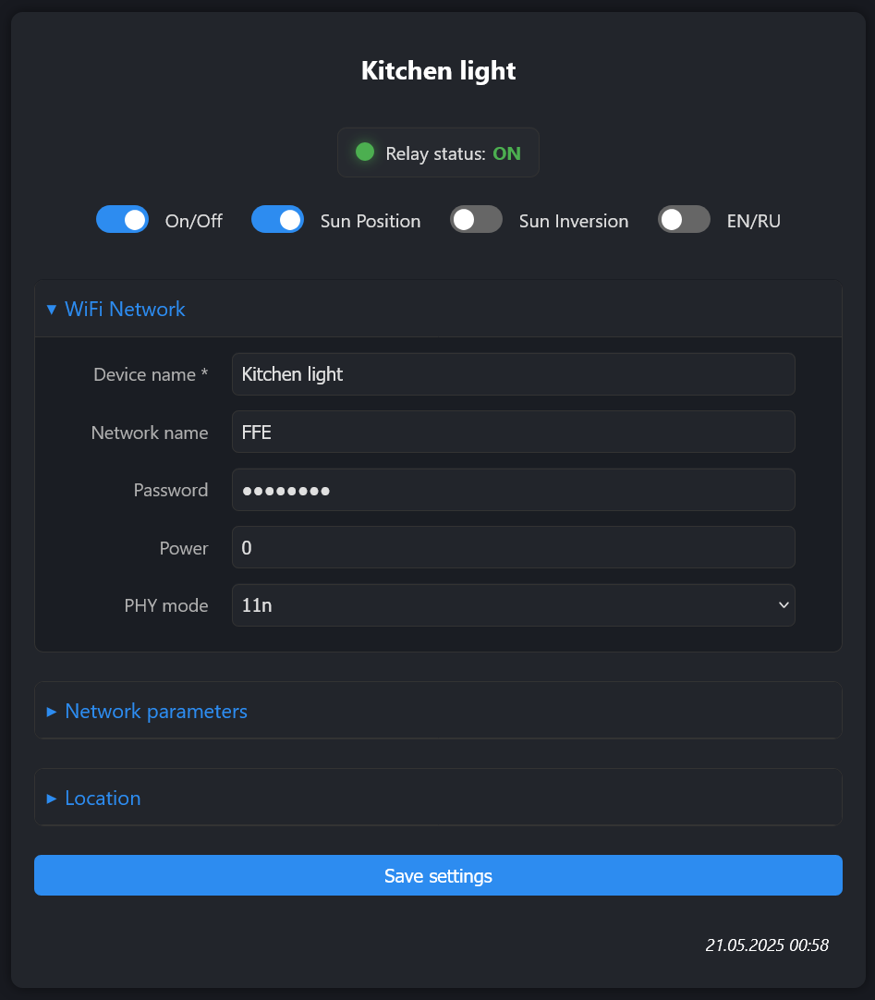
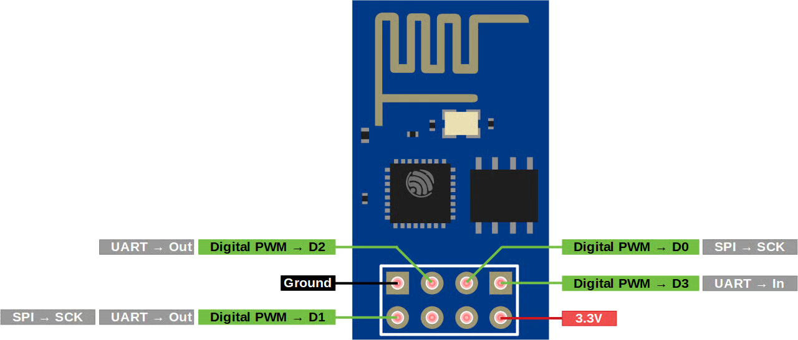
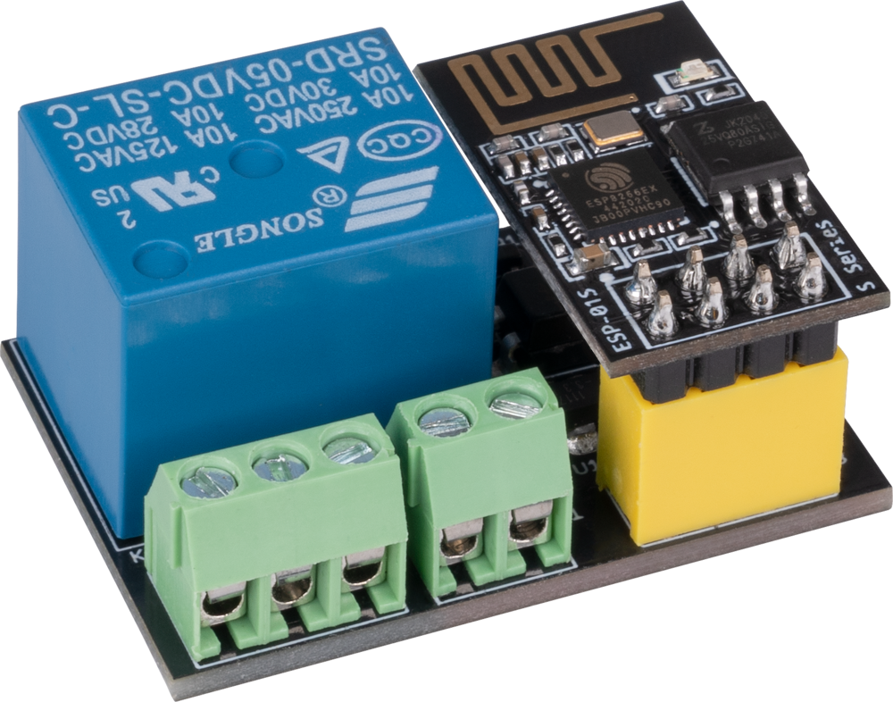

# ESP01 Smart Relay



## Overview

ESP01 Smart Relay is a smart relay controller based on ESP8266 (ESP-01S) with web interface. It allows you to control your lighting or other electrical devices remotely, and includes an astronomical clock feature to automate operation based on sunrise and sunset times.

The device can be used for automatic lighting control based on the sun's position, making it ideal for:
- Outdoor lighting that should turn on at sunset and off at sunrise
- Indoor lighting control without the need for additional motion or light sensors
- Energy-efficient operation by adapting to seasonal daylight changes
- Automated greenhouse lighting systems
- Security lighting with natural day/night cycle
- **Aquarium lighting** to simulate natural daylight cycles for fish and plants
- Vivarium or terrarium lighting systems for reptiles and amphibians
- Automated plant watering systems triggered at specific times
- Billboard and advertising display lighting control
- Pet feeder automation based on daily schedules
- Ventilation systems that change modes from day to night
- Building facade illumination with sunset activation
- Motorized curtains or blinds control (with appropriate relays)
- Staircase or hallway night lighting with sunrise deactivation
- Decorative garden lighting and water features
- Seasonal holiday lighting displays with precise timing

With the sun position inversion feature, you can also set the device to operate during daylight hours instead, perfect for systems that should work only during the day.

## Features

- WiFi connectivity with customizable power settings
- Web interface for easy configuration and control
- Manual relay control (on/off)
- Automatic control based on sun position (sunset/sunrise)
- Inverted sun position mode (on during day or night)
- NTP time synchronization
- Multi-language support (English/Russian)
- REST API for integration with other systems
- Prometheus-compatible metrics endpoint

## Quiet Start Feature (Advanced)

To prevent the relay from briefly clicking (for about 100 ms) when the ESP01 Smart Relay powers on, you can implement a "quiet start". This typically involves both a hardware modification to your relay module and a software change.

**Hardware Modification:**
You will need to modify your relay module to control the relay via GPIO3 instead of the default GPIO0. This usually involves rerouting the control signal trace on the relay PCB or adding a jumper wire. Please refer to your specific relay module's schematic for details.

**Software Modification:**
1. Open the `include/relay.h` file in the project.
2. Change the `RELAY_PIN` definition from `0` to `3`:
   ```cpp
   // Before
   // #define RELAY_PIN 0

   // After
   #define RELAY_PIN 3
   ```
3. Recompile and re-flash the firmware.



**Important Considerations:**
- GPIO0 is used by the ESP8266 for entering bootloader mode (flashing mode). By moving the relay control to GPIO3, you ensure that GPIO0 remains free for its standard boot functions, which can make re-flashing the device easier.
- While GPIO3 is generally safer in terms of boot behavior than GPIO0 or GPIO2, some ESP-01 modules might still exhibit minor, very brief fluctuations on GPIO3 during power-up. The most robust solution for eliminating any startup click involves using a relay module with an opto-isolated input and appropriate pull-up/pull-down resistors, or a relay driver circuit that ensures a defined state during power-up.
- Modifying hardware carries risks. Proceed with caution and ensure you understand the changes you are making.

## Hardware Requirements



- ESP8266 (ESP-01S) module
- Relay module compatible with ESP-01S
- 3.3V power supply

## Software Setup

### Flashing with VS Code

1. Install [VS Code](https://code.visualstudio.com/) and [PlatformIO extension](https://platformio.org/install/ide?install=vscode)
2. Clone this repository or download the code
3. Open the project folder in VS Code
4. **Important**: Before flashing, rename `data/default_settings.json` to `data/settings.json` and modify it with your network credentials
5. Build the filesystem image: PlatformIO → Project Tasks → Build Filesystem Image
6. Upload the filesystem image: PlatformIO → Project Tasks → Upload Filesystem Image
7. Build and upload the firmware: PlatformIO → Project Tasks → Upload

## Configuration

### Initial Settings

The `settings.json` file contains the basic configuration:

```json
{
  "wifi": {
    "devname": "ESP01 relay module",
    "ssid": "",
    "password": "",
    "power": 0,
    "phy_mode": "11n"
  },
  "ntp": {
    "ntp_server": "pool.ntp.org",
    "ntp_timezone": "Europe/London"
  },
  "location": {
    "lat": 51.5287398,
    "lng": -0.2664056
  },
  "update":{
    "enable": true
  }
}
```

Make sure to:
- Replace `YOUR_WIFI_SSID` and `YOUR_WIFI_PASSWORD` with your actual WiFi credentials
- Set your timezone and preferred NTP server
- Update latitude and longitude to your actual location (required for sun position features)

**Note:** If you leave the SSID and password fields empty in the settings.json file, the device will automatically switch to Access Point mode during startup. In this mode, it will create its own WiFi network with the name specified in the "devname" field (e.g., "ESP01 relay module"). You can connect to this network and access the web interface to configure the device.

## Usage

After successful flashing and connecting to WiFi, the device will:

1. Connect to your WiFi network
2. Show a blue LED indicator when connected
3. Create a web interface accessible at the device's IP address
4. Allow control through web interface or API endpoints

### Web Interface

Access the web interface by entering the device's IP address in a web browser. From there you can:

- Toggle the relay on/off
- Enable sun position-based automation
- Configure device settings

### API

The device provides a REST API for programmatic control. See the Swagger documentation at `/swagger.yaml` for details.

#### API Endpoints

You can control the device programmatically using simple HTTP requests:

- **GET `/api/relaystate`** - Get current relay state
  ```
  curl http://device-ip/api/relaystate
  ```

- **GET `/api/gettoggle`** - Get all toggle states (relay, sun position, sun inversion)
  ```
  curl http://device-ip/api/gettoggle
  ```

- **POST `/api/toggle`** - Control relay and automation settings
  ```
  curl -X POST http://device-ip/api/toggle \
    -H "Content-Type: application/json" \
    -d '{"state":"on"}'
  ```

  Other options:
  ```json
  {"state":"on|off"}             // Turn relay on or off
  {"sunPosition":"on|off"}       // Enable/disable sun-based automation
  {"sunInversion":"on|off"}      // Invert sun position logic
  ```

#### Swagger Documentation

The device includes a Swagger/OpenAPI specification at `/swagger.yaml` that documents all available endpoints. You can:

1. Download this file from the device
2. Import it into tools like Swagger UI, Postman, or Insomnia
3. Test API calls directly from these tools
4. Generate client code for your preferred programming language

### Metrics

System metrics are available at `/metrics` in Prometheus-compatible format. This allows you to:

- Monitor the device's performance and health over time
- Create dashboards with tools like Grafana
- Set up alerts for critical conditions

To collect these metrics with Prometheus:

1. Add this configuration to your `prometheus.yml`:
   ```yaml
   scrape_configs:
     - job_name: 'esp01_relay'
       static_configs:
         - targets: ['device-ip:80']
       metrics_path: '/metrics'
       scrape_interval: 60s
   ```

2. Available metrics include:
   - CPU usage (now, 1m, 5m averages)
   - Free memory (now, 1m, 5m averages)
   - WiFi signal strength in dBm (now, 1m, 5m averages)
   - WiFi disconnection counts
   - System uptime in seconds

## Troubleshooting

If the device fails to connect to WiFi (due to incorrect credentials or if SSID and password are not provided), it will create its own access point named according to the `devname` setting. Connect to this network to configure WiFi credentials through the web interface.

## ⚠️ Electrical Safety Warning

**RISK OF ELECTRIC SHOCK:** This device is designed to control electrical circuits that may carry dangerous voltages. Improper installation or use can result in serious injury or death.

- Installation should be performed only by qualified electricians
- Ensure all power is disconnected before installing or servicing
- Do not exceed the rated voltage for the relay module
- Use appropriate insulation and enclosures when installing in humid environments
- Do not modify the hardware components unless you fully understand the implications
- Follow all local electrical codes and regulations
- The device MUST be powered by a safe, low-voltage power supply (typically 3.3V)
- Keep all electrical connections in a proper electrical enclosure away from contact

The authors and contributors of this project assume no liability for any injury, damages, or losses resulting from the use of this device.
